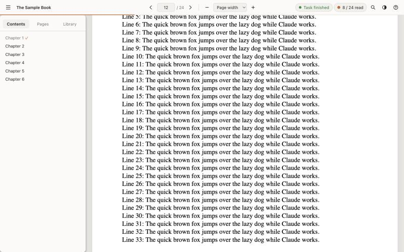
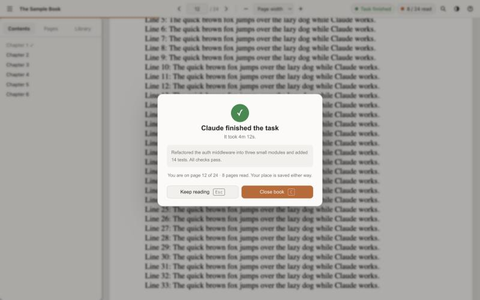

# Book Reader for Claude Code

Read a book while Claude works. When a task runs for more than a few seconds,
your PDF opens by itself at the exact place you stopped. When the task is done,
the reader tells you and asks whether to close the book or keep reading.





> A community mod for Claude Code. Not affiliated with or endorsed by Anthropic.

## Features

- **Opens while Claude works.** Once a task has run for 5 seconds (configurable),
  the current book opens in its own window. Short tasks never open it.
- **Resumes where you stopped**: same page, same scroll position, same zoom.
  A new book starts at page 1.
- **Remembers what you read.** A page counts as read after it filled most of the
  window for 6 seconds (configurable) while you were there; mark pages by hand
  with `m`. The contents tick a chapter once all of its pages are read, a page
  grid shows every read page, and a bar tracks the whole book.
- **A complete PDF reader** built on [PDF.js](https://mozilla.github.io/pdf.js/):
  continuous scrolling, zoom (buttons, keys, ⌘+scroll, pinch, page width, whole
  page), go to page, search, clickable contents and links, a library of your
  books, and light, sepia and dark themes.
- **Tells you when the task is done**: a dialog in the reader with how long it
  took and the start of Claude's answer, a desktop notification, and a band above
  Claude's prompt, each offering **Close book** or **Keep reading**. Your place
  is saved either way.
- **Local and offline.** PDF.js is bundled, the reader server listens on
  `127.0.0.1` only, and nothing is sent anywhere.

## Requirements

| | |
| --- | --- |
| Claude Code | 2.1.288 or newer (terminal or the desktop app's Code tab). Mods built on function hooks are an early-access Claude Code feature and can change between releases. |
| Node.js | 18 or newer. The mod looks on your `PATH`, in your login shell and in the usual install folders (Homebrew, nvm, fnm, Volta, asdf, mise; `Program Files` and nvm-windows on Windows). Or set **Path to node** in `/config`. |
| OS | macOS, Linux or Windows 10/11. |
| Browser | Any modern browser. With Chrome, Edge, Brave, Chromium or Vivaldi installed, the book opens in its own window without tabs or an address bar (Windows always has Edge). |

What each OS uses:

| | macOS | Linux | Windows |
| --- | --- | --- | --- |
| File picker (`/book choose`) | Finder dialog | `zenity`, `kdialog` or `yad`, whichever is installed | Windows file dialog (PowerShell) |
| Reader window | Chromium browser in app mode, else the default browser | Chromium browser in app mode, else `xdg-open` | Chrome, Edge or Brave in app mode, else the default browser |
| "Task finished" notification | Notification Center | `notify-send` (libnotify), when installed | Tray notification (PowerShell) |

Without a file picker, add books with `/book <file.pdf>`. Without `notify-send`,
the reader's own dialog and the band above Claude's prompt still tell you.

## Install

### From this repository (a plugin marketplace)

In Claude Code:

```
/plugin marketplace add Nomad06/claude-book-reader
/plugin install book-reader@claude-book-reader
```

Or in a terminal:

```bash
claude plugin marketplace add Nomad06/claude-book-reader
```

```bash
claude plugin install book-reader@claude-book-reader
```

### From a clone

```bash
git clone https://github.com/Nomad06/claude-book-reader.git ~/claude-book-reader
```

Then load it for one session:

```bash
claude --plugin-dir ~/claude-book-reader
```

or for every session (the desktop app included), in `~/.claude/settings.json`:

```json
{
  "env": {
    "CLAUDE_CODE_PLUGIN_DIRS": "~/claude-book-reader"
  }
}
```

On Windows, clone into a folder of your choice and use its full path, with
doubled backslashes in JSON:

```json
{
  "env": {
    "CLAUDE_CODE_PLUGIN_DIRS": "C:\\Users\\you\\claude-book-reader"
  }
}
```

## Use

Pick a book once, then just work:

```
/book choose
```

| Command | What it does |
| --- | --- |
| `/book` | Open the current book now (asks for one if there is none) |
| `/book choose` | Pick a PDF with the system file dialog |
| `/book <file.pdf>` | Read that PDF: absolute (`/…`, `C:\…`, `\\server\share\…`), `~/…`, or relative to the project |
| `/book list` | Your books with their progress |
| `/book <n>` | Switch to book number *n* of the list |
| `/book close` | Close the reader window (your place is kept) |
| `/book auto on` / `off` | Open the book by itself while a task runs, or not |
| `/book delay <seconds>` | How long a task must run before the book opens (`0`: at once) |
| `/book status` | What is set up |
| `/book restart` | Restart the reader server (books and places are kept) |

### Reader keys

| Key | |
| --- | --- |
| `→` `j` `n` / `←` `k` `p` | Next / previous page |
| `Space` / `⇧Space` | Scroll down / up |
| `Home` / `End` | First / last page |
| `g` | Go to page |
| `+` `−` `0` (or with ⌘ / Ctrl) | Zoom in / out / page width |
| ⌘ / Ctrl + scroll, pinch | Zoom |
| `⌘F` / `Ctrl+F` or `/` | Find |
| `m` | Mark the page read or unread |
| `u` | First unread page |
| `b` | Sidebar: contents, pages, library |
| `t` | Theme: light, sepia, dark |
| `?` | All shortcuts |

When a task finishes, `Esc` keeps reading and `C` closes the book.

## Settings

In `/config` (or `/plugin configure book-reader@claude-book-reader`):

| Setting | Default | |
| --- | --- | --- |
| Open the book automatically | on | Same as `/book auto on` / `off` |
| Delay before opening (seconds) | 5 | Same as `/book delay` |
| Reader window | `app` | `app`: its own window in Chrome, Edge, Brave, Chromium or Vivaldi; `browser`: a tab in your default browser |
| Desktop notification when a task finishes | on | On Linux this needs `notify-send` |
| Reader server port | 47321 | Change it if another program uses that port |
| Path to node | *(empty)* | Leave empty to find `node` on your `PATH` |

`/book auto` and `/book delay` override the first two.

## How it works

```
Claude Code ──hooks──▶ book-reader mod ──HTTP──▶ reader server (Node, 127.0.0.1:47321)
                       (hooks/register.tsx)       (server/server.mjs)
                                                         │  serves PDF.js + your PDF
                                                         │  pushes task events (SSE)
                                                         ▼
                                                  reader window (viewer/)
```

- The **mod** hooks the start and end of each of Claude's turns. When a turn
  runs past the delay, it starts the reader server if needed and asks it to
  show the book. When the turn ends, it tells the server, which tells the
  reader, and shows the band above the prompt.
- The **reader server** keeps your library and progress in
  `~/.claude/book-reader/state.json`, serves the reader page and your PDF, and
  pushes task events to the open reader. It stops by itself after 6 hours
  without use. One server is shared by all your Claude Code sessions; a server
  left over from another version of the mod is replaced automatically.
- The **reader** is a PDF.js viewer that reports your place and read pages back
  to the server.

Security details are in [SECURITY.md](SECURITY.md).

## Limitations

- **Linux needs a few desktop tools** for everything to work: `zenity` (or
  `kdialog`, `yad`) for the file picker, `notify-send` for notifications, and
  `xdg-open` or a Chromium browser for the reader window. Without a way to open
  a browser, `/book` gives you the address to open by hand.
- **WSL** counts as Linux: the reader server runs inside WSL, so the file
  picker, notification and browser come from WSL's desktop support, if any.
- **One server for all sessions.** If two Claude Code sessions run tasks at the
  same time, the reader shows the events of both.
- **Early-access Claude Code API.** The mod is built on function hooks, which
  Claude Code may change between releases.
- A browser only lets a page close windows it opened itself; when it refuses,
  the reader shows "Bookmarked" and you close the window yourself.

## Development

```
.claude-plugin/plugin.json        manifest and settings
.claude-plugin/marketplace.json   lets the repo be added as a marketplace
hooks/register.tsx                the mod: /book, turn hooks, the band above the prompt
hooks/register.test.tsx           its tests (claude plugin test)
types/index.d.ts                  the mod's state contract
server/server.mjs                 the reader server, no dependencies
server/platform.mjs               what it runs on macOS, Linux and Windows (pure, unit-tested)
test/server.test.mjs              server tests over HTTP (node --test)
test/platform.test.mjs            per-OS command tests; parses the PowerShell scripts where PowerShell exists
viewer/                           the reader page; viewer/vendor/pdfjs is PDF.js
scripts/update-pdfjs.sh           re-vendors PDF.js
```

```bash
npm test
```

runs all three suites (`node --test test/platform.test.mjs test/server.test.mjs`
and `claude plugin test .`); CI runs them on macOS, Linux and Windows;
`npm run validate` runs `claude plugin validate .`.

While developing, load your clone with `claude --plugin-dir .`: Claude Code
reloads the mod when you save. Run `/book restart` after changing
`server/server.mjs`. Claude Code writes the mod's type declarations to
`.claude-plugin/types/` when it loads the mod (git ignores them); after that,
`npx tsc -p .` type-checks the mod.

To move to another PDF.js version: `npm run update-pdfjs -- <version>`, then
update the version in `NOTICE` and check the reader.

## License

[Apache-2.0](LICENSE). PDF.js and its bundled resources keep their own licenses;
see [NOTICE](NOTICE).
